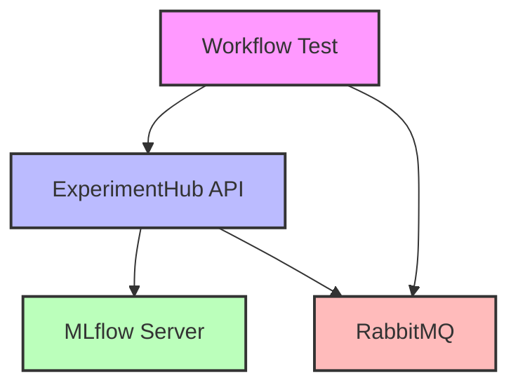
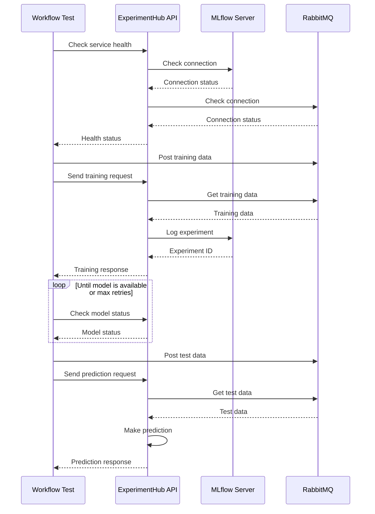
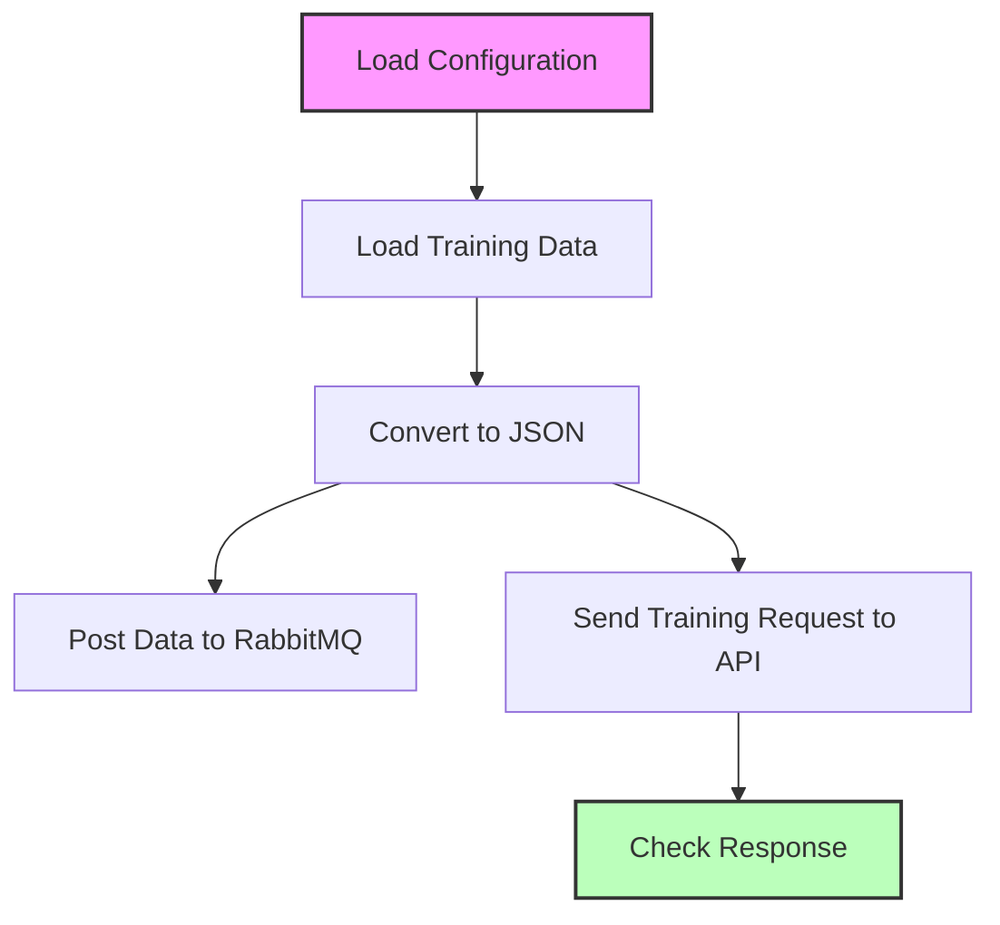
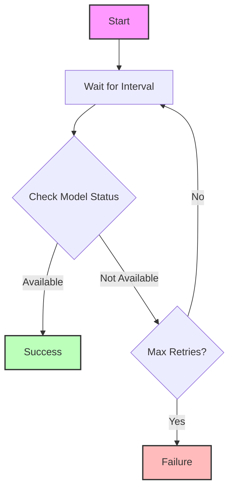
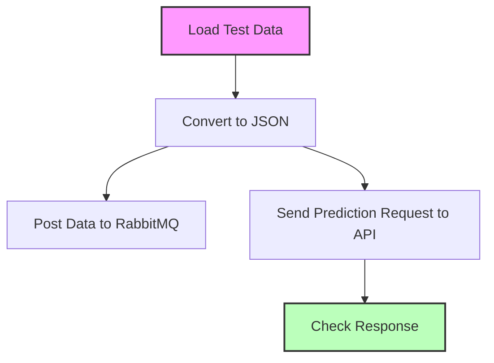
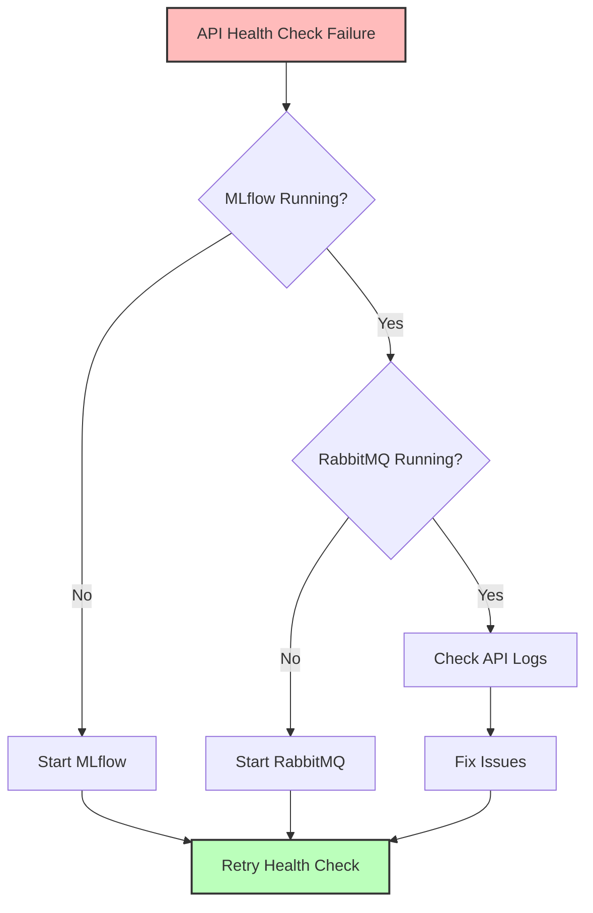

# ObservML Workflow Test Documentation for Detect Model

## Overview

The Workflow Test is a comprehensive testing framework for the ObservML platform that validates the entire machine learning pipeline for the Detect model. It ensures that all components of the system are working correctly and can communicate with each other effectively.

This test is designed to:
- Verify that all required services are running and healthy
- Test the Detect model training process using Decision Tree algorithm
- Monitor the status of the trained model
- Validate the prediction capabilities of the trained model

## Prerequisites

Before running the Workflow Test, ensure that the following services are running:

1. **MLflow Server** - Tracking server for ML experiments
   - Default URL: `http://localhost:5000`
   - Start with: `mlflow server --host 0.0.0.0 --port 5000`

2. **ExperimentHub API** - Backend API for the ObservML platform
   - Default URL: `http://localhost:8011`
   - Start with: `uvicorn ExperimentHubAPI:app --host localhost --port 8011`

3. **RabbitMQ** - Message broker for data exchange
   - Default port: `5672`
   - Management interface: `15672`
   - Typically started as a service or via Docker

### Required Dependencies

The Workflow Test requires the following Python packages:
- requests
- pandas
- pyyaml
- pika
- mlflow
- distinctipy
- pgmpy

These dependencies can be installed using Poetry:
```bash
poetry add requests pandas pyyaml pika mlflow distinctipy pgmpy
```

## Architecture

The Workflow Test interacts with several components of the ObservML platform:



- **Workflow Test**: Orchestrates the testing process and validates results
- **ExperimentHub API**: Provides endpoints for training and prediction
- **MLflow Server**: Tracks experiments, models, and metrics
- **RabbitMQ**: Handles data exchange between components

## Workflow Steps

The Workflow Test follows these steps:



### 1. Service Health Checks

The test begins by checking if all required services are running:

```python
# Check if ExperimentHub API is running
api_running = check_service(API_URL, "ExperimentHub API")

# Check if MLflow server is running
mlflow_running = check_service(MLFLOW_URL, "MLflow server")
```

It then checks the health of the ExperimentHub API plugins:

```python
# Check API health
api_healthy = check_api_health()
```

This verifies that the API can connect to both MLflow and RabbitMQ.

### 2. Model Training

Once the services are confirmed to be running, the test trains a decision tree model:

```python
# Train decision tree model
training_success = train_decision_tree()
```

This step:
1. Loads the DecisionTree configuration from `configs/detect/DecisionTree.yaml`
2. Loads training data from `data/detect_train.xlsx`
3. Sends a training request to the ExperimentHub API
4. Posts the training data to RabbitMQ

The configuration specifies:
- The experiment type (`FaultIsolationExperiment`)
- The target column (`Output (S)`)
- The model type (`dt` for decision tree)
- Other parameters like datetime format



### 3. Model Status Monitoring

After sending the training request, the test monitors the status of the model:

```python
# Check model status
model_available = check_model_status()
```

This step:
1. Periodically checks if the model is available in the ExperimentHub API
2. Retries for a configurable number of attempts with a configurable interval
3. Returns success when the model is available or failure after max retries



### 4. Prediction

Once the model is available, the test makes a prediction:

```python
# Make prediction
prediction_success = make_prediction()
```

This step:
1. Loads test data from `data/detect_test_0.xlsx`
2. Posts the test data to RabbitMQ
3. Sends a prediction request to the ExperimentHub API
4. Validates the prediction response



## Configuration Options

The Workflow Test can be configured through several variables at the top of the script:

```python
# Configuration
API_URL = "http://localhost:8011"  # ExperimentHub API URL
MLFLOW_URL = "http://localhost:5000"  # MLflow server URL
RABBIT_HOST = "localhost"
RABBIT_PORT = "5672"
MODEL_NAME = "detect"  # Name for our model (must match folder name in configs)
```

Additional configuration options in the `check_model_status` function:

```python
def check_model_status(max_retries=12, retry_interval=5):
    # ...
```

- `max_retries`: Maximum number of attempts to check if the model is available
- `retry_interval`: Time in seconds between retry attempts

## Troubleshooting

### Common Issues

#### Services Not Running

If the test reports that services are not running, ensure that:
- MLflow server is running on the specified port
- ExperimentHub API is running on the specified port
- RabbitMQ is running and accessible

Example error:
```
❌ ExperimentHub API is not running at http://localhost:8011
```

Solution: Start the ExperimentHub API with:
```bash
uvicorn ExperimentHubAPI:app --host localhost --port 8011
```

#### API Health Check Failures

If the API health check fails, check:
- MLflow connection in the ExperimentHub API
- RabbitMQ connection in the ExperimentHub API
- Logs of the ExperimentHub API for detailed error messages

Example error:
```
mlops: ❌ UNHEALTHY
  Details: {'status': 'error', 'message': 'Connection refused', 'uri': 'http://localhost:5000'}
```

Solution: Ensure MLflow is running and accessible from the ExperimentHub API.



#### Model Training Failures

If model training fails, check:
- Configuration file for errors
- Data format and availability
- ExperimentHub API logs for detailed error messages

Example error:
```
❌ Failed to send training request.
```

Solution: Check the ExperimentHub API logs and ensure the configuration and data are correct.

#### Missing Dependencies

If you encounter missing dependencies, install them with Poetry:

```bash
poetry add <package-name>
```

Common missing dependencies include:
- mchmm (for MarkovChain models)
- pgmpy (for Bayesian Network models)
- distinctipy (for visualization)

## Running the Workflow Test

To run the complete workflow test:

```bash
python workflow_test.py
```

Expected output on success:
```
=== ObservML Workflow Test ===

✅ ExperimentHub API is running at http://localhost:8011
✅ MLflow server is running at http://localhost:5000

--- API Health Check ---
mlops: ✅ HEALTHY
  Details: {'status': 'connected', 'uri': 'http://localhost:5000'}
datastream: ✅ HEALTHY
  Details: {'status': 'connected', 'host': 'localhost', 'port': 5672}

--- Training Decision Tree Model ---
...

--- Checking Model Status ---
...

--- Making Prediction ---
...

✅ Workflow test completed successfully!
```

## Conclusion

The Workflow Test for the Detect model is a powerful tool for validating the ObservML platform's fault detection capabilities. By running this test regularly, you can ensure that all components of the system are working correctly and catch issues early in the development process.
