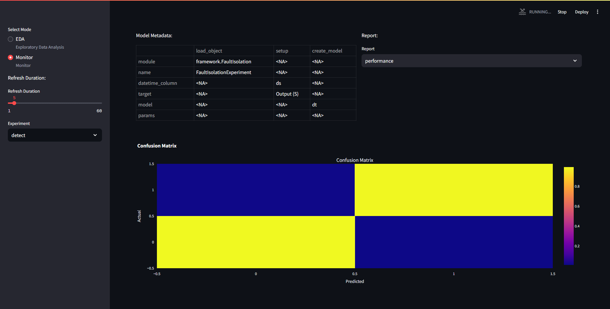

# Client-side Use
This section explains how to communicate with a running MMLW application, which includes a short description on how to compile instructions for training sessions, then how predict and loading/saving functions are used.

Since the developer environment is not required, first a short client-side setup is included.

## Client-side environment setup.
    
First download Python and an IDE (We recommend VSC or Pycharm).

Pull from repo https://github.com/adamipkovich/controlsoft_MMLW.git, branch "main".
This repo is currently private and requires permission for git clone to work. You can also pull it manually. 

Install packages if only the client-side code is used:
```
pip install -r mindeps.txt
```

## Example project
In the "main" branch, you can find the files relevant to client-side use:

1. Hydra template config directory -- *configs* folder
    - folders that represent an Experiment-ID and a rabbit-queue -> these folders include .yaml files that are experiment specifications.
    - \_\_init\_\_.py -- a must have or hydra cannot build the configuration file
    - config.yaml -- this yaml file contains what experiments should be trained with which configuration (adding here key/value pairs will train an experiment with the name ${key}, with model configuration located in ${value} - which are .yaml files. Removing a key/value pair means that it will not train that experiment again. )
    - Template Experiment specifications are provided under the Models section. 

2. api_commands.py - precompiled set of commands. A must have.

3. data (e.g. ./data/) - testing data to be posted on rabbit. Each is stored in .xlsx format, but the system can only receive .json formatted data! NOTE: Recent developments contain a formatter for json files.

4. data.yaml - defines local paths to data, if not passed as objects. (used by train_stript_local.py)

5. example files: train_script_local.py, train_script_obj.py, test_script.py
    Data folder and .yaml is not necessary, data can be passed as an object as well.
    We provide 2 examples for training, one of which automatically reads in data from the project, defined in the .yaml file. The other reads the .xlsx-s in to pass it as an object in memory (as an example for memory-based handling of data). 

6. docker-compose.yaml which will be the heartbeat of the application.

An example for project structure looks as follows:
```
    data
        example.data.xlsx
    configs
        rabbit_queue_name_1
            ml_model_template.yaml
        rabbit_queue_name_2
            ml_model_template.yaml
        __init__.py
        config.yaml
    api_commands.py
    data.yaml
    docker-compose.yaml
```
NOTE: In this form, the project is only capable of sending instructions.

The hydra structure has a main configuration file, which is called config.yaml.
Here, keywords represent the folder names, and the values the .yaml file that should be used for the key (hydra dynamically builds the configuration files, but one keyword can only have one .yaml injected). Here it would look like:

```
defaults:
    rabbit_queue_name_1 : experiment_template.yaml
    rabbit_queue_name_2 : experiment_template.yaml
```
.yaml files will be appended together in config.yaml with keys rabbit_queue_name_1 and rabbit_queue_name_2 as a dict.

The system will open up channels with names: rabbit_queue_name_1 and rabbit_queue_name_2. 


Let us suppose that we want to train a PCA model on the pump dataset. The main config.yaml file should look as:

```
defaults:
    pump : pca.yaml
```

where pca.yaml is:

```
load_object : ## this is a must - should not remove -
# unique dynamic import of class (dynamic package download is not yet supported)
  module: framework.FaultDetection  # framework folder, FaultDetection.py
  name: FaultDetectionExperiment # import this class
setup: # this is also a must have. each experiment requires different parameters.
    # MUST NOT HAVE A "data" KEYWORD!
    datetime_column : "ds" #-> index, column
    datetime_format : "ms" # if saved integer, then provide timedelta e.g. milisecond,
    # if string then the format must be defined such as %y-%m-%d.

eda: # from this key, inclusion is arbitrary
create_model : 
#the key name is a function in the experiment, and the value is the parameter of the function.
    model : "pca" 
    # here you can change the model for other models that is loaded in FaultDetectionExperiment class
    # e.g. "ee" #"dbscan" #"pca" # etc
    params: ## pca does not require tuning. 
    ## if you want to change the model so that only 
    #60% of the variance is explained, then:
        n_components : 0.6
...
# can add new functionalities to an experiment by overloading the class' functions. 
#In the run function, each key, e.g. "function_name" function in the class
# is called with the parameters defined below the key.
function_name : # define "function_name" az a class function
    param1 : 'a' # a parameter of "function_name"
    param2 : 'b' # another parameter of "function_name"
```

General rules of writing the configuration files:

 - eda can be turned of by removing its key (e.g. commenting out the line)

 - if you do not want to change parameters, please do not declare them/include them under the *params:* keyword. The system is robust, but configuration files may or may not include *must-have*-s. This will be shown in model specification.

 - Cannot read complex data structures, only basic types + lists/dicts

 - for setup, datetime_column can be left out, and will use default index, except for time series analysis, where it is a *must-have*.

 - Models section contains relevant parameters. If not, then the model's (in ./models/{experiment}/{model_name}) \_\_init\_\_ function contains modifiable parameters.

 - If naming a target/datetime variable, and it is not existent, the system will throw an error. It is often just a "ill-defined" configuration.

 - For the string datetime formating definitions, [click here](https://www.programiz.com/python-programming/datetime).

 - The system facilitates data formating and auto-retraining function. Additional configuration is required.

For FaultIsolation and TimeSeriesAnalysis, Retraining function is available.
```
setup: ## Fault Isolation setup
    ...
    predict_window : 1000 ## does not work for PCA, controls how many points there should be in the prediction figure. 
    retrain :
      retrain_window : 5000 ## if none, retrain on all data. Otherwise retrain on the last 5000 samples.
      # If the amount of data is less than 5000, it will train on all data.
      metric : "Accuracy" ## depending on experiment -> Accuracy, F1, Precision, Recall for Fault Isolation
      metric_threshold : 0.9 ## threshold that will cause retraining 
      higher_better : True ## less or more better? -> depends on the measure.
```

There is also a formating function for incoming non-xlsx sourced .json file. This currently works on one template asked for by a partner:
```
setup: ## Fault Isolation setup
    ...
    format :  ## settings for data reading...
        name : "pivot" # mode
        id : "tsdata" # what variable
        max_level : 1
        columns : "target"
        index : "date"
        values : "value" 
```

Which can be used for the following template:

```
{
    "tsdata": [
        {
            "target": "xy sensor1",
            "date": "2024-08-07T00:00:00",
            "value": 0.12
        },
        {
            "target": "xy sensor1",
            "date": "2024-08-07T00:00:10",
            "value": 0.11
        },
        {
            "target": "xy sensor2",
            "date": "2024-08-07T00:00:00",
            "value": 231
        },
        {
            "target": "xy sensor2",
            "date": "2024-08-07T00:00:10",
            "value": 223
        }
    ]
}
```

NOTE: For Text mining methods, a query format may be added to generate required files that are often is a very specific format. IT IS NOT YET IMPLEMENTED.

    
## Training

Compiling training instructions is straightforward, api_commands.py has a function called *compile_config*, whose output can be used to request the mmlw:backend to start building specific models.

###compile_config
___
:::api_commands.compile_config
___

In the config.yaml one can define any amount of "queue"-s -- These represent not only a rabbit queue for data flow, but an ID for the training models. You can also overwrite model IDs. Models are wrapped in an Experiment object, which handles specific utilities for the models. 
 
PLEASE NOTE THAT PREDICTION DATA IS NOT SAVED HERE, AND SHOULD BE DIRECTED TO AN OUTSIDE DATABASE. 

Here is a model configuration:
```
    load_object : ## this is a must have! This loads the experiment dinamically. 
    module: framework.FaultIsolation ## Module
    name: FaultIsolationExperiment #x class name
    setup: ## this is outside of dynamic loop 
    #- this must be present. It must assign the data for the experiment in a way it can handle.
        datetime_column : ds # will set column ds index
        # NOTE: different experiment handle function parameters differently! 
        target : "Output (S)" # what to classify - target variable
    create_model : 
        model : "dt" #"ee" #"dbscan" #"pca" # 
        params:

```

Some configuration designate a target variable - and must be given to use (e.g. fault isolation, time series analysis), otherwise the service will refuse to train the model (throws an error).

*create_model* function's params keyword represent the model's arguments. Therefore, if you have e.g. a pca, variance_explained argument will be given here, provided it has the same name as defined in the model *__init__()*.

If the template is finished, one should send it to the application. The communication system currently works similarly to the [Remote Procedure Call (RPC)](https://www.c-sharpcorner.com/article/asynchronous-rpc-communication-using-rabbitmq/) principle, which means that a request is sent to the backend, which will in turn pull data out of rabbit, and sends back a response. This is how we check on whether the data has been sent and used.


The example script *train_script_obj.py* shows how to wrap data json objects to be sent to training. It uses a function named *train* extensively. Data is loaded in the script with pandas, but it can extended with anything.
___
api_commands.train()
:::api_commands.train
___


In *train_script_local.py*, api_commands.train_models is used -- which reads data from the harddrive. The path to the data is defined in data.yaml. 
___
api_commands.train_models()
:::api_commands.train_models
___

To try out the example file, type to the terminal (run it in console):
```
python train_script_local.py
```

The frontend asks for the figures every 5 seconds and will automatically refresh the figures, if any models are trained and available, it will drop the error, and start showing the figures. Here, the detect experiment was used with DecisionTree.yaml. 




However, the predict figures remain empty. If the backend is busy, the frontend will not be able to load.


If multiple models were trained, one can also select which to monitor on the left hand side, under "Experiments"


One can also inspect the logs in Docker Desktop's log tab:


## Predict and Monitoring

Prediction will impact the frontend's prediction figure(s). It currently works similar to the train, except that no configuration is required to use predict. If there is no model with the name the predict asks for, then it will throw an error.


Let's test the prediction function of the decision tree we trained in the previous section.

The *test_script.py* employs the api_commands.predict function:

### api_commands.predict
___
:::api_commands.predict
___

Change mode_name arg for queue and id selection.
*test_script.py* contains:
```
    from api_commands import predict # get predict
    import pandas as pd # pandas read in xlsx

    for i in range(8): ## test dataset is separated into 8 different xlsx files.
        data = pd.read_excel(f"./data/detect_test_{i}.xlsx") # read
        data.reset_index(inplace=True, drop=True)
        data = data.to_json() # to json 
        predict(url="http://localhost:8010", model_name = "detect", data = data, rhost = "localhost", rport = "5100") ##simple way to post predict request.
        #predict sends data to "detect" queue, and send a train request to the url provided.
```

Processing the data will update the figures, and so:


PLEASE NOTE THAT ONLY JSON FILES CAN BE SENT!

## Loading Experiment

Loading a model is necessary if the same model is to be used with the same sensors. It saves computing power, and time spent with parameterizing.

api_commands comes with a function called load_experiment. This will only load the state of the model it was saved in, most likely after training.

api_commands.load_experiment()
___
:::api_commands.load_experiment
___


To load a model, you have to find the wanted model's run_id, if it has not been initialized (no models with ID). If the model ID was previously used, it will load back that model.
Run ID can be read from the mlflow ui. e.g. for an LSTM model, you have to find the experiment initialized as the rabbit queue name, select a sympathetic run and copy its ID:


*load_script.py* will load a run id if given. For local testing, train a model, restart service, and use the ID of the trained model. The ID can be found in the MLFLOW repository.


We gave the keyword "load_try", which did not override my previous model. It is an instance of the trained model saved on mlflow before.


We also saved the trained/predicted model to the MLFLOW repository.

```
python save_script.py
```

which can be loaded back with load_script.py if the mlflow run id is given!


## Notes

- Cannot yet compare models programatically.
- Retraining autmatically is not yet included
- PCA package has problems with indexing, so shouldn't be fed with data that contains duplicate indices
- Bug with BayesNet - only works locally as the environment could not yet make the necessary C++ compilations -- It works but only locally.
- Some models do not have "proper" predict functions -- process mining is a train only model which repeats train function under prediction function, without saving the results.

If you notice any bugs, please save the error message, and send it to the developer.