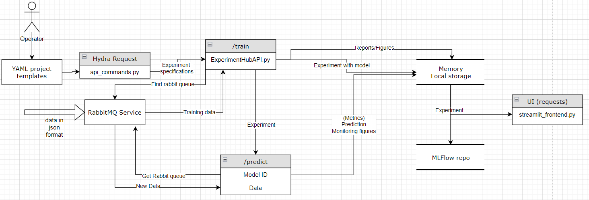

# Welcome to MMLW's Documentation

This is the documentation for project 2020-1.1.2-PIACI-KFI-2020-00062

The project focuses on modular machine learning workflows (MMLW) for anomaly detection as case studies. The package is easily extendable.
Currently focuses on Docker-based deployment.

The package is currently under development, and therefore TODO-s and bugs are noted in relevant codes. For further information, please contact the developers (ipkovichadam@gmail.com, kummer.alex@mk.uni-pannon.hu)

## Prerequisites
1. Computer with at least 16GB RAM (less is required if only docker/linux distribution is installed), 32-64GB free space
2. [Docker Engine](https://docs.docker.com/engine/install/) -- if using Docker images
3. [Python 3.11.8](https://www.python.org/downloads/release/python-3119/)
5. Access to [MMLW_controlsoft](https://github.com/adamipkovich/controlsoft_MMLW.git) GitHub repository for source code.
6. Access to [MMLW docker repo](https://hub.docker.com/repository/docker/ipkovichadam/mmlw/general) 
7. [Git](https://git-scm.com/downloads) 
8. Any IDE (VSC, Pycharm)
9. git clone https://github.com/adamipkovich/controlsoft_MMLW.git
10. git checkout mmlw_template_project
11. cd (set current directory to controlsoft_MMLW)

## First Look at MMLW application

MMLW was developed to provide a simple interface for training and deploying models in the same environment. It contains two services that is required for the main service (backend) to work. The first is the RabbitMQ package  [[1]](https://medium.com/cuddle-ai/async-architecture-with-fastapi-celery-and-rabbitmq-c7d029030377) that handles the data transactions between services (here machines and the backend). It is more efficent to use brokers than http requests, and come with a number of advantages [[2]](https://idomagor.medium.com/what-is-a-message-broker-and-why-we-need-them-da0140dae750). The second is Mlflow that implements version control for ML models, and can be used to track specific experiments. *Without these two services, the backend cannot be used.*     

The following figure depicts the communication between microservices and the basic workflow of the backend:

The two main commands are train and predict. Train creates a new model, while predict uses an exisiting one, and therefore there will be an error should you use predict without training. Additional functionalities include loading from the mlflow repository, which bypasses the need for training models. This way, the same model can be used for several sensors of the same type.

For further information on how to communicate with the MMLW App, refer to section: client-side use.

# Roadmap for further improvements

 1. Python Package 
 1.a Click-based Command line Interface for ease of use
 2. Logging and testing environments
 3. Webhooks - sending emails through alerts
 4. Git integration for extending the deployed service through repositories. (pull codes automatically, so that only the enviromnent must be rebuilt.)
 4.a Automatic installation of required packages. (use of pipreqs )
 5. Adding celery for faster concurrency
 6. Multiple selectable figures on frontend (select relevant figures)
