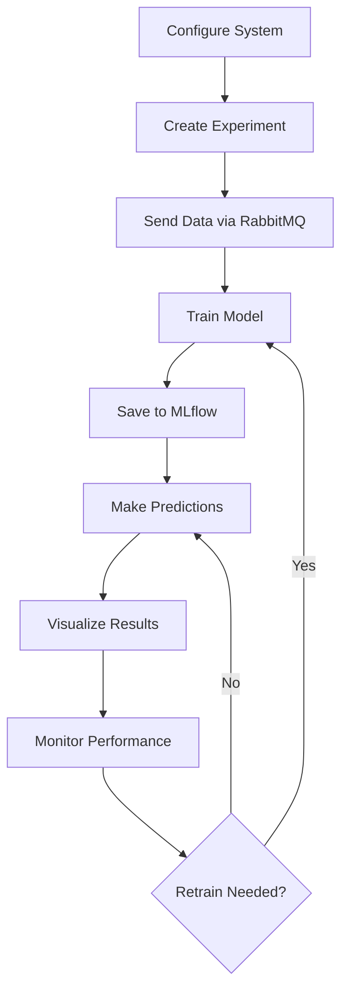
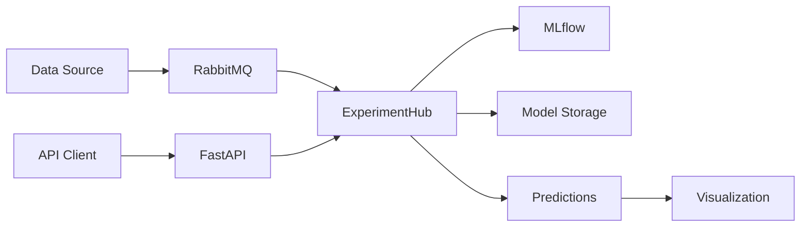

# Welcome to ObservML Documentation

ObservML is a comprehensive machine learning framework designed for process monitoring, anomaly detection, fault isolation, and time series analysis. Built with a plugin-based architecture, it provides easy-to-use microservices with integrated MLOps, tracking, and deployment capabilities.

## What is ObservML?

ObservML (Observable Machine Learning) is a modular framework that focuses on industrial process monitoring and anomaly detection. The project evolved from MMLW (Modular Machine Learning Workflows) to provide a more robust, scalable, and production-ready solution for machine learning in industrial environments.

### Key Features

- **ExperimentHub Architecture**: Central management system for multiple experiments
- **Plugin System**: Extensible architecture with MLOps, DataStream, and custom plugins
- **Configuration-Driven**: YAML-based configuration for easy setup and deployment
- **REST API**: FastAPI-based API with automatic documentation
- **Real-time Processing**: RabbitMQ integration for streaming data and predictions
- **MLOps Integration**: Built-in MLflow support for experiment tracking and model registry

## Prerequisites

Before getting started with ObservML, ensure you have the following:

### System Requirements
1. **Computer**: At least 16GB RAM (32GB+ recommended for production), 32-64GB free disk space
2. **Operating System**: Linux, macOS, or Windows with WSL2
3. **Python**: Version 3.11 or higher
4. **Docker**: Docker Engine and Docker Compose (for containerized deployment)
5. **Git**: For cloning the repository

### Development Tools (Optional)
- **IDE**: VSCode, PyCharm, or any preferred IDE
- **Poetry**: For dependency management (recommended)
- **Make**: For using Makefile commands (optional)

## Quick Installation

### 1. Clone the Repository

```bash
git clone https://github.com/adamipkovich/observml.git
cd observml
```

### 2. Choose Installation Method

#### Option A: Poetry (Recommended)
```bash
# Install Poetry if not already installed
curl -sSL https://install.python-poetry.org | python3 -

# Install dependencies
poetry install

# Activate virtual environment
poetry shell
```

#### Option B: pip
```bash
# Create virtual environment
python -m venv venv
source venv/bin/activate  # On Windows: venv\Scripts\activate

# Install dependencies
pip install -r requirements.txt
```

### 3. Start Infrastructure Services

```bash
# Start MLflow and RabbitMQ using Docker
docker-compose up -d mlflow rabbitmq
```

### 4. Configure ObservML

```bash
# Copy example configuration
cp hub_config.yaml hub_config.yaml

# Edit configuration as needed
nano hub_config.yaml
```

### 5. Start the API Server

```bash
python ExperimentHubAPI.py
```

The API will be available at:
- **API Server**: http://localhost:8010
- **API Documentation**: http://localhost:8010/docs
- **MLflow UI**: http://localhost:5000
- **RabbitMQ Management**: http://localhost:15672 (guest/guest)

## Architecture Overview

ObservML is built around several core components:

### ExperimentHub
The central component that manages all experiments, plugins, and configurations. It provides:
- Experiment lifecycle management (create, train, predict, save, load)
- Plugin coordination and health monitoring
- Configuration management
- API endpoint handling

### Plugin System
ObservML uses a plugin architecture for extensibility:

- **MLOps Plugin**: Handles experiment tracking and model registry (MLflow)
- **DataStream Plugin**: Manages real-time data streaming (RabbitMQ)
- **Custom Plugins**: Extensible system for adding new functionality

### Experiment Types
Modular experiment implementations for different use cases:
- **Time Series Analysis**: Forecasting and anomaly detection in time series data
- **Fault Detection**: Anomaly detection in sensor data
- **Fault Isolation**: Classification and root cause analysis
- **Process Mining**: Business process analysis and optimization

## Basic Workflow

ObservML follows a simple workflow for machine learning experiments:



### Step-by-Step Process

1. **Configuration**: Set up plugins and experiment types in `hub_config.yaml`
2. **Data Preparation**: Send training data through RabbitMQ queues
3. **Experiment Creation**: Create and configure experiments via API
4. **Training**: Train models with automatic MLflow tracking
5. **Prediction**: Make real-time predictions on streaming data
6. **Monitoring**: Track model performance and trigger retraining when needed

## Communication Architecture

ObservML uses a microservices architecture with message-based communication:



### Key Benefits

- **Decoupled Architecture**: Services can be scaled independently
- **Asynchronous Processing**: Non-blocking operations for better performance
- **Fault Tolerance**: Message queues provide reliability and retry mechanisms
- **Scalability**: Easy to add more workers or services as needed

## Getting Help

### Documentation Structure

This documentation is organized into several sections:

- **[Local Development](localdev.md)**: Setting up a development environment
- **[Deployment](serve.md)**: Production deployment with Docker
- **[Client Usage](client.md)**: Using the API and client libraries
- **[API Reference](api.md)**: Complete API documentation
- **[Configuration](configuration.md)**: Configuration options and examples
- **[Plugin System](plugin_system.md)**: Extending ObservML with plugins
- **[Models](models.md)**: Available models and algorithms
- **[Experiments](experiments.md)**: Experiment types and configurations

### Support Channels

- **GitHub Issues**: Report bugs and request features
- **GitHub Discussions**: Ask questions and share ideas
- **Documentation**: Comprehensive guides and API reference
- **Examples**: Sample configurations and use cases

### Contributing

ObservML is an open-source project and welcomes contributions:

1. **Fork** the repository
2. **Create** a feature branch
3. **Make** your changes
4. **Add** tests for new functionality
5. **Submit** a pull request

## Next Steps

Now that you have ObservML installed, you can:

1. **[Set up local development](localdev.md)** for experimentation
2. **[Deploy to production](serve.md)** using Docker
3. **[Learn the API](api.md)** for programmatic access
4. **[Explore examples](client.md)** to understand common use cases
5. **[Configure experiments](configuration.md)** for your specific needs

## Project History

ObservML evolved from the MMLW (Modular Machine Learning Workflows) project, which was part of research project 2020-1.1.2-PIACI-KFI-2020-00062. The project has been redesigned with:

- Modern plugin architecture
- Improved scalability and performance
- Better separation of concerns
- Enhanced configuration management
- Production-ready deployment options

The focus remains on providing accessible machine learning tools for industrial process monitoring and anomaly detection, but with a more robust and extensible foundation.
