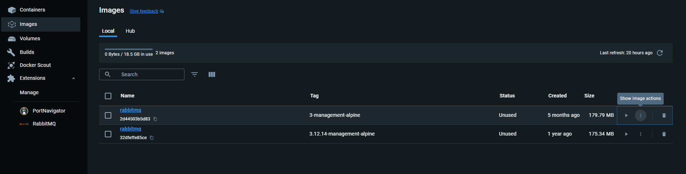
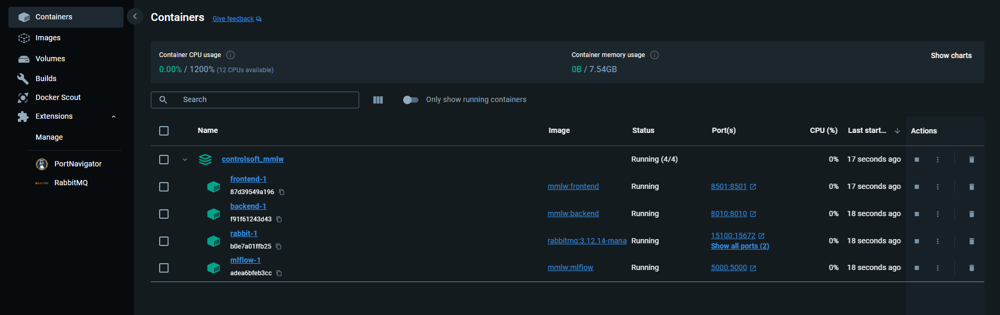
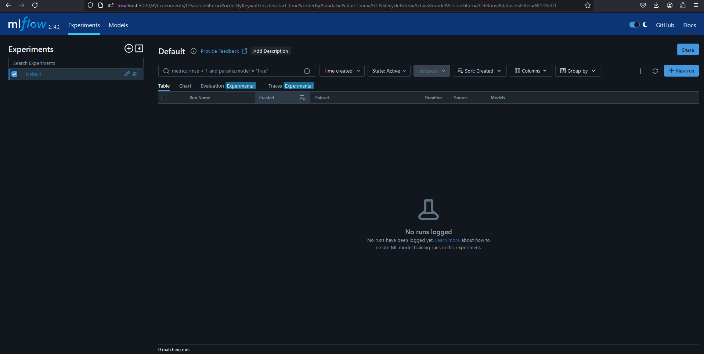
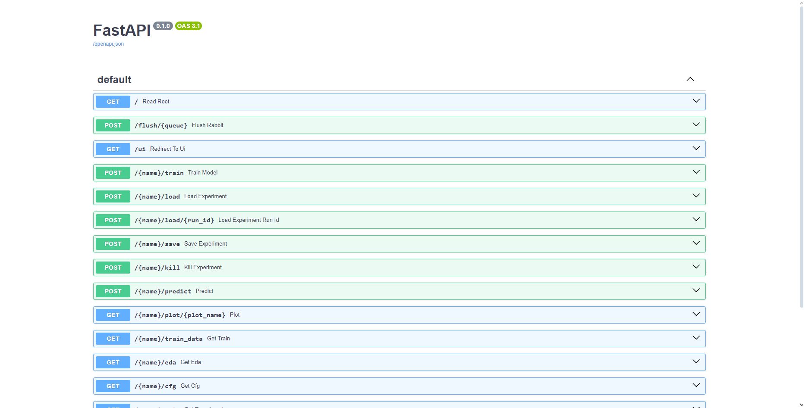
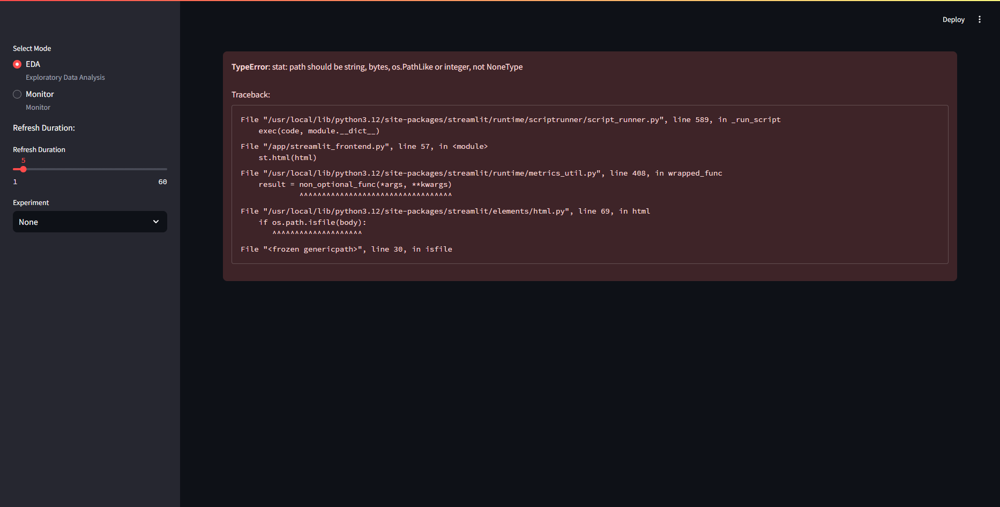

# Containerization of MMLW -- Docker
This section will tell the reader how to use the MMLW in production. For starters, you can find .dockerfiles (for mlflow, backend) in the repository, which have to be built first to be used. Docker compose will start the MMLW by launching interconnected microservices with the help of docker compose.
 

The example project contains the docker-compose.yaml and the configuration files we require.

___
### Project template

Pull "main" branch to obtain the code to communicate with the backend. You can use the project template's mindeps.txt for minimal dependency:

``` 
pip install -r mindeps.txt
```

NOTE: Minimal dependencies will make you unable to run locally. It will only allow for scripts to run. This way, the size of the virtual environment is reduced significantly.
___
## RabbitMQ

This image is relatively easy to get. It should be pulled from [this](https://hub.docker.com/_/rabbitmq) Docker repository. 
Docker is used in terminal, so either cmd, or a python IDE can accomodate. Walkthrough for:
- [Linux](https://sysdig.com/learn-cloud-native/container-security/what-is-docker-cli/)
- [Windows](https://learn.microsoft.com/en-us/virtualization/windowscontainers/quick-start/run-your-first-container) 
- [VSCode](https://developer.skao.int/en/latest/howto/docker-vscode.html)
- [Pycharm](https://www.jetbrains.com/help/pycharm/docker.html#install_docker)

In this version of MMLW, we tested with rabbitmq:3.12.14-management-alpine, but can be used with any version that is less than 2.0.0.
So type into the terminal:
```
docker pull rabbitmq:3.12.14-management-alpine ## pull image_name:image_tag
```
If you use Docker Desktop, and everything went fine, then the image will appear:




## Building images
In case of not being able to access to the prebuild Docker images, we also provide a tutorial on creating these images. DOCKER ENGINE IS REQUIRED!

First you have to pull the git repository, and then navigate to the "main" branch:

```
git pull 
...
git checkout main
```

NOTE: BUILDING THE IMAGES DO NOT REQUIRE A WORKING VIRTUAL ENVIRONMENT!


Building requires the following Docker command:

```
docker build . -t {name}:{tag} -f {filename.dockerfile, preferably in root directory}
```

If you want to build the images locally:
```
docker build . -t mmlw:mlflow -f mlflow.dockerfile

docker build . -t mmlw:frontend -f streamlit_frontend.dockerfile

docker build . -t mmlw:backend -f service.dockerfile
```

For the first run with build, the backend may take up to 1000s to build this image, which is reduced to ~600s after caching.


Please do not modify the branch (DO NOT push to branch) -- open a new branch instead, if you modify the code:

```
    git branch [--branch_name]
```

NOTE: The Rabbit image must be pulled for successful start.

___
## Running Docker images with compose
Docker compose [[3]](https://docs.docker.com/compose/) starts the application from images and creates a network, through which the applications can communicate.
It requires a docker-compose.yaml file that specifies the behaviour of the stack.

The structure is as follows:

    services:
        service_A : # service name
            image : A:latest # image-name:tag
            ports:
             - 5100:5672 ## will expose local port 
             # 5672 to global 5100, outside is only reachable from 5100
            environment:
             HUB_URL : "http://service_B:8010" ## OS environmental variables
             # defined in dockerfile
             ## can refer to service_B IP address as service_B
            networks:
             - common_network
        service_B : 
            image : B:latest
            ports:
             - 8010:8010 # CAN be the same
            networks:
             - common_network
    networks: # define existing/nonexisit networks to be used
    # can also be an outside network...
        common_network: ## name
            driver: bridge
            name: common_network # we recommend this to be the same as the key
    
A docker-compose file is already provided in the GitHub repository (mmlw_template_project branch), and therefore will not be necessary to write out own. For further understanding, please see [[5]](https://www.educative.io/blog/docker-compose-tutorial). Its contents are the following:

```
services:
  rabbit:
    image: rabbitmq:3.12.14-management-alpine
    ports:
      - 5100:5672
      - 15100:15672
    networks:
       - mml_network
    restart:
      on-failure
  mlflow:
    image: mmlw:mlflow
    ports:
      - 5000:5000
    networks:
      - mml_network 
    restart:
      on-failure
  backend:
    image: mmlw:backend
    ports :
      - 8010:8010
    depends_on:
      rabbit :
        condition: service_started
      mlflow :
        condition: service_started
    environment:
      MLFLOW_URI : "http://mlflow:5000"
      RABBIT_HOST : "rabbit"
      RABBIT_PORT : "5672"
      RABBIT_USER : "guest"
      RABBIT_PASSWORD : "guest"
    restart:
      on-failure
    networks:
      - mml_network

  frontend:
    image: mmlw:frontend    
    ports:
      - 8501:8501
    depends_on:
      backend:
        condition: service_started
    environment:
      HUB_URL : "http://backend:8010"
    restart:
      on-failure
    networks:
      - mml_network    


networks:
  mml_network:
    driver: bridge
    name: mml_network

```
To run the set of applications, type in:
```
docker compose up
```

What you will see in the Desktop app is:


___
## Interfaces

If the compose file has not been changed, then the mlflow client can be opened thought a webbrowser:
```
http://localhost:5000
```



The management version enables monitoring though a TCP ip. It is currently set on 15100. The starting username and password is always guest. Open though webbrowser:
```
http://localhost:15100
```


The backend and frontend is also viewable:
Backend:
```
http://localhost:8010/docs
```


Frontend:
```
http://localhost:8105
```


The frontend will show error if no models are found. DO NOT PANIC! It will work after the first training/loading session.

If everything opened, then congratulations, you have set up the application with Docker!
