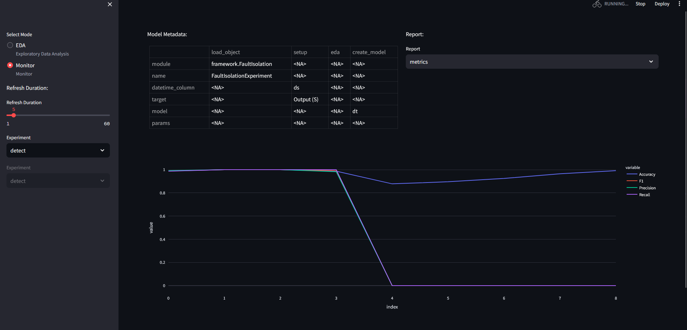
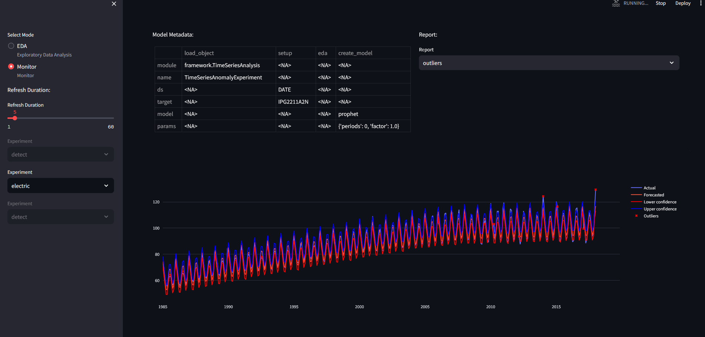

# Results for Experiments
This section provides the results for specific experiment cases for datasets. 
In the example version of the projects, several templates are provided:

1. Fault isolation on detect_dataset [digital output signal for circuit, with 3 alterante voltages and currents] -- Decision Tree 
2. Fault isolation on hmm data - Hidden Markov Model
3. Time series analysis on time_series_analysis - LSTM
4. Electricity data - Prophet

5. (Multivariate) Fault Detection on Pump data (50 sensors) - PCA

6. Tenesse-Eastman reactor data for fault detection - PCA


8. Process-mining - TopKRules - on operator data of cable head maker machines (specifically machine 27). (cable_head_mach_27)

9. Process-mining - heuristic miner on machine state data (cable head machines) (traces_csoft_oper)

The config.yaml looks the following:
```
defaults:
  ## Fault isolation test 
  - detect : DecisionTree.yaml
  - hmm : HMM.yaml
  ## Time series test
  #- time_series : LSTM.yaml
  #- electric : Prophet.yaml
  ## Fault detection test
  #- pump : pca.yaml
  #- ten_detect : iforest.yaml
  ## Process mining test
  #- oper : HeuristicsMiner.yaml 
  #- process_mining : TopKRules.yaml
```


We encourage you to try them out. Comment in/out any key/values pairs. Please Note that sending requests/data in quick succession may freeze the backend. 
Please note that there is a timer between sending the request in the script, which can be adjust as seen fit.

## Fault Isolation

Fault isolation experiment is used during the identification of states and specific labels. The most trivial use is to uncover anomalies by providing the "anomaly" label.
In the case study we use the data from an electric circuit, where digital output is labeled as an anomaly if it is high (1). Inputs are alternating voltage and current, which is often problematic with linear models.

Zeroth step is always to ensure that the app is running:
```
    docker compose up
```

For training the model, we define a decision tree model. First step is to modify the project template to include only the "detect" dataset.

config.yaml
```
    defaults:
        - detect : DecisionTree.yaml
        - hmm : HMM.yaml
```

To do a train request:

```
python train_script_local.py
```

The EDA results is the following for the detect dataset:

A set of histograms for the variables:


A correlation heatmap, categorical data provides complications, and therefore is omitted at this stage:


If we switch for hmm dataset, we will see the following for the variables:


Feature importance for decision trees:


Prediction result:


## Time Series Analysis - Multiple models


For training the model, we define a LSTM and a prophet model. First step is to modify the project template to include only the "time_series" and "electric" dataset.

config.yaml
```
    defaults:
        - time_series : LSTM.yaml
        - electric : Prophet.yaml
```
Outliers for time series dataset:


Outliers for electric dataset:


Prediction for time series dataset requires the following code:
```
if __name__ == "__main__":
    from api_commands import predict
    import pandas as pd

    for i in range(8):
        data = pd.read_excel(f"./data/time_series_test_{i}.xlsx")
        data.reset_index(inplace=True, drop=True)
        data = data.to_json()
        predict(url="http://localhost:8010", model_name = "time_series, data = data, rhost = "localhost", rport = "5100")
```


Metrics for predictions:


## Fault Detection - Parameterizing models

config.yaml
```
defaults:
  - pump : pca.yaml
  - ten_detect : iforest.yaml
```

PCA performance on pump data:


2PC outlier detection for 50 variables:


To use test_script.py with the pump dataset, use the following code:

```
if __name__ == "__main__":
    from api_commands import predict
    import pandas as pd

    for i in range(8):
        data = pd.read_excel(f"./data/pump_test_{i}.xlsx")
        data.reset_index(inplace=True, drop=True)
        data = data.to_json()
        predict(url="http://localhost:8010", model_name = "pump", data = data, rhost = "localhost", rport = "5100")
```

The outliers figure changes with the addition of new data:

This is an exception, each other model will modify the predict figure.

Isolation Forest performance on Tenesse Eastman data:


the parameters have been set to:
    params:
      n_estimators : 100
      contamination : "auto"
      random_state : 0


We can check the outliers for flow feed to reactor A:


## Text Mining


For heuristics miner, we get the following results if we use the oper data:


Here the resulting network provides information on state transitions between machines. This can be used to find errors in process sequences.


We also applied association rules on machining data:


Where numbers represent operator IDs:
@ITEM=1=ID0998
@ITEM=2=ID4385
@ITEM=3=ID4355
@ITEM=4=ID4163
@ITEM=5=ID4872
@ITEM=6=ID4820
@ITEM=7=ID4445
@ITEM=8=ID4882
@ITEM=9=ID4528
@ITEM=10=ID4493
@ITEM=11=ID0937
@ITEM=12=ID4932
@ITEM=13=ID4429
@ITEM=14=ID4167
@ITEM=15=ID4529
@ITEM=16=ID4641
@ITEM=17=ID0420
@ITEM=18=ID4491
@ITEM=19=ID4132
@ITEM=20=ID4287
@ITEM=21=ID4718
@ITEM=22=ID4442
@ITEM=23=ID3846
@ITEM=24=ID4291
@ITEM=25=ID4794
@ITEM=26=ID0997

NOTE: IT IS NOT GOOD PRACTICE TO USE PREDICT WITH THESE MODELS